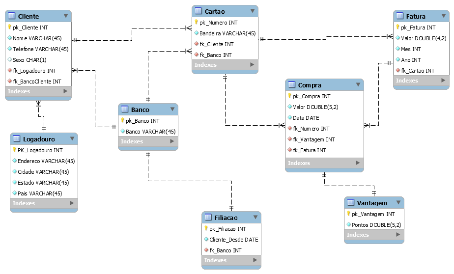

## Trabalho Final da disciplina Banco de Dados2
Este projeto acadêmico, desenvolvido em 2019, trata-se de um banco de dados de cartão de crédito, registrando o valor de faturas, bem como o valor de cada compra e pontos de vantagem gerados - além, também é mantida a data de filiação do cliente à instituição que gera o cartão.

Abaixo é possível observar o Diagrama Entidade-Relacionamento, ilustrando a estrutura do banco de dados.

*Diagrama Entidade-Relacionamento* 